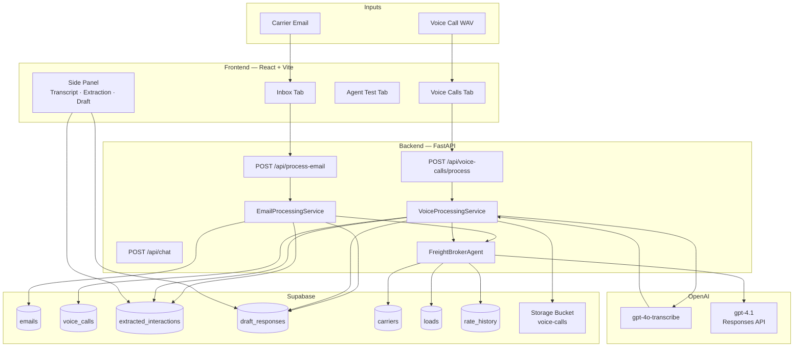
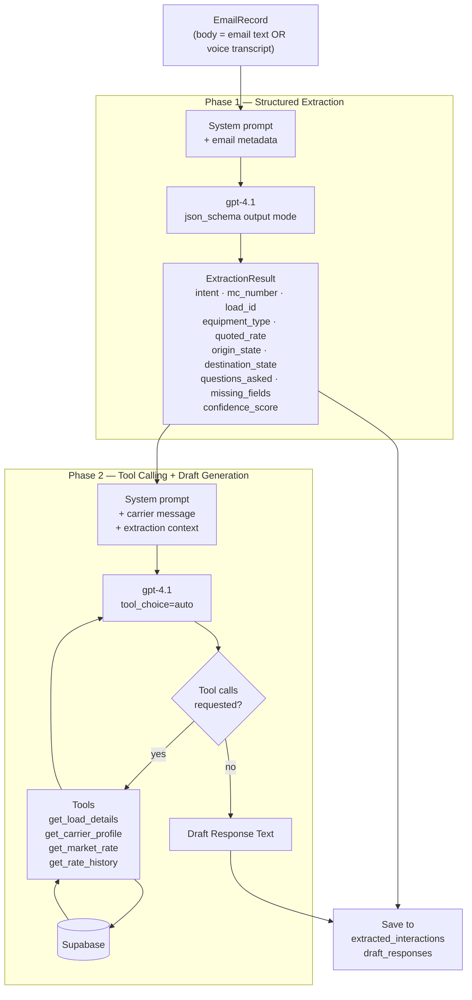

# Goodlane Freight Broker Inbox Assistant

An AI-powered inbox assistant for freight brokers. It processes inbound carrier communications — emails and voice calls — extracts structured freight data, calls internal business tools for context, generates broker response drafts, and presents everything for human review before sending.

---

## Table of Contents

1. [Overview](#overview)
2. [Overall Architecture](#overall-architecture)
3. [Agentic Architecture](#agentic-architecture)
4. [Supabase Setup](#supabase-setup)
5. [Backend Setup](#backend-setup)
6. [Frontend Setup](#frontend-setup)
7. [Voice Call Setup](#voice-call-setup)
8. [API Reference](#api-reference)
9. [Evaluations](#evaluations)
10. [Deployment](#deployment)
11. [Project Structure](#project-structure)

---

## Overview

Freight brokers receive dozens of carrier communications daily — rate inquiries, counter-offers, availability notices, load questions, and onboarding requests. Manually reading, extracting key information, looking up load and carrier data, and drafting replies is slow and error-prone.

This system automates that pipeline end-to-end:

| Step | What happens |
|---|---|
| Ingest | Carrier sends an email or voice call |
| Transcribe | Voice calls are transcribed with `gpt-4o-transcribe` |
| Extract | LLM extracts intent, MC number, load ID, rates, equipment, and missing fields |
| Contextualize | Agent calls tools to look up load details, carrier profile, market rates, and rate history |
| Draft | LLM writes a human-sounding broker response |
| Review | Broker sees extraction + draft in a side panel, approves or rejects |

---

## Overall Architecture



---

## Agentic Architecture

The agent runs two sequential phases for every communication (email or voice transcript).



### Phase 1 — Extraction

Uses the OpenAI Responses API with `json_schema` strict output mode. The LLM reads the message and returns a typed JSON object with every field or `null`. There is no post-processing or regex — the schema enforces structure.

Extracted fields:

| Field | Type | Description |
|---|---|---|
| `intent` | enum | `availability`, `counter_offer`, `rate_quote`, `booking_interest`, `load_question`, `information_request`, `general_inquiry` |
| `mc_number` | string or null | Motor Carrier number |
| `load_id` | string or null | Load reference number |
| `equipment_type` | string or null | Box Truck, Sprinter Van, Flatbed, Reefer, Dry Van |
| `quoted_rate` | float or null | Rate in USD quoted by carrier |
| `availability_status` | bool or null | Whether carrier is stating availability |
| `origin_state` | string or null | Two-letter origin state code |
| `destination_state` | string or null | Two-letter destination state code |
| `questions_asked` | list[str] | Specific questions the carrier is asking |
| `missing_fields` | list[str] | Required fields absent from the message |
| `confidence_score` | float | 0.0–1.0 extraction confidence |

### Phase 2 — Tool Calling

Uses the OpenAI Responses API with tools enabled. The LLM decides which tools to call based on the extracted context. The loop runs until the model stops requesting tool calls and produces text.

| Tool | When called | Data source |
|---|---|---|
| `get_load_details` | `load_id` is known | `loads` table |
| `get_carrier_profile` | `mc_number` is known | `carriers` table |
| `get_market_rate` | lane + equipment known | hardcoded benchmark lookup |
| `get_rate_history` | carrier asks about historical/average rates | `rate_history` table |

### Voice Normalization

Before Phase 1 runs on a voice call, there is one extra step:

```
WAV bytes → gpt-4o-transcribe (with freight domain prompt) → transcript text → EmailRecord.body
```

The transcript is the `body` field. Everything else in the agent pipeline is identical to email processing.

---

## Supabase Setup

### 1. Database Tables

Open your Supabase project → SQL Editor and run `database/schema.sql`.

This creates:

| Table | Purpose |
|---|---|
| `emails` | Inbound carrier emails |
| `carriers` | Carrier profiles (MC number as primary key) |
| `loads` | Open load listings |
| `extracted_interactions` | Phase 1 extraction results |
| `draft_responses` | Phase 2 generated drafts |
| `rate_history` | Weekly per-mile rate data by lane and equipment type |
| `voice_calls` | Voice call metadata + transcript |

Then run `database/seed.sql` to load sample emails and carriers.

For rate history data, run `database/rate_history_insert.sql` (721 rows of weekly lane data).

### 2. Storage Bucket (for voice calls)

Go to Supabase → Storage → New bucket:
- Name: `voice-calls`
- Visibility: **Private**

### 3. Row Level Security

Run without RLS during development (the backend uses the `service_role` key which bypasses RLS). Enable RLS in production and add policies per table.

---

## Backend Setup

```bash
cd backend

# Copy and fill in your credentials
cp .env.example .env
```

Edit `backend/.env`:

```env
SUPABASE_URL=https://your-project.supabase.co
SUPABASE_SERVICE_KEY=eyJ...           # service_role key from Supabase → Settings → API
OPENAI_API_KEY=sk-...
OPENAI_MODEL=gpt-4.1                  # or gpt-4o, gpt-4o-mini
```

```bash
# Create and activate a virtual environment
python -m venv venv

# Windows
venv\Scripts\activate

# macOS / Linux
# source venv/bin/activate

pip install -r requirements.txt

uvicorn app.main:app --reload --port 8000
```

- API: `http://localhost:8000`
- Interactive docs: `http://localhost:8000/docs`
- Agent trace log: `backend/logs/agent.log` (DEBUG level — full prompts, tool payloads, token counts)

---

## Frontend Setup

```bash
cd frontend

cp .env.example .env
# VITE_API_URL=http://localhost:8000   (default — change if backend is on a different port)

npm install
npm run dev
```

Frontend runs at `http://localhost:5173`.

### Tabs

| Tab | What it shows |
|---|---|
| **Inbox** | All carrier emails — click a row to open extraction + draft side panel |
| **Voice Calls** | Voice call queue — upload WAV, sync from storage, process, review |
| **Agent Test** | Dev sandbox — send any message and see extraction + tools called + draft instantly |

---

## Voice Call Setup

Voice files are stored in Supabase Storage. There are two ways to get files into the queue:

### Option A — Upload through the UI

In the Voice Calls tab, click **Upload WAV** → select a file → optionally add caller name, phone, and MC number → click Upload.

### Option B — Upload directly to Supabase Storage, then sync

1. Upload files to the `voice-calls` bucket via the Supabase dashboard
2. In the Voice Calls tab, click **Sync Storage** — this scans the bucket and creates DB records for any untracked files

### Processing

Click **Process** on any pending call or **Process Next** in the header. The pipeline:

1. Downloads the WAV from Supabase Storage
2. Transcribes with `gpt-4o-transcribe` (25 MB / ~23 min limit per file)
3. Runs the full agent pipeline (same as email)
4. Shows transcript + extraction + draft in the side panel

> **File size tip**: WAV at 44kHz stereo is ~10 MB/min. For calls longer than ~20 minutes, convert to mono 16kHz WAV or MP3 first:
> ```bash
> ffmpeg -i input.wav -ac 1 -ar 16000 output.wav
> ```

---

## API Reference

### Emails

| Method | Path | Description |
|---|---|---|
| `GET` | `/api/emails` | List inbox with extraction summaries |
| `GET` | `/api/emails/{email_id}` | Full email + extraction + draft |
| `POST` | `/api/process-email` | Run agent pipeline for an email |

### Drafts

| Method | Path | Description |
|---|---|---|
| `POST` | `/api/drafts/generate` | Regenerate draft for a processed email |
| `POST` | `/api/drafts/approve` | Mark draft as approved |
| `POST` | `/api/drafts/reject` | Mark draft as rejected |

### Voice

| Method | Path | Description |
|---|---|---|
| `GET` | `/api/voice-calls` | List all voice calls with extraction summaries |
| `GET` | `/api/voice-calls/{call_id}` | Full call + transcript + extraction + draft |
| `POST` | `/api/voice-calls/upload` | Upload a WAV/MP3 file (multipart/form-data) |
| `POST` | `/api/voice-calls/process` | Run full pipeline for a call |
| `POST` | `/api/voice-calls/backfill` | Sync DB records from storage bucket |

### Dev / Testing

| Method | Path | Description |
|---|---|---|
| `POST` | `/api/chat` | Run any message through the agent without touching the DB |
| `GET` | `/health` | Health check |

**Example — process an email:**
```bash
curl -X POST http://localhost:8000/api/process-email \
  -H "Content-Type: application/json" \
  -d '{"email_id": "CE0042"}'
```

**Example — test the agent directly:**
```bash
curl -X POST http://localhost:8000/api/chat \
  -H "Content-Type: application/json" \
  -d '{
    "message": "Hi, what have PA to NJ Box Truck rates been like lately?",
    "mc_number": "445521",
    "equipment_mentioned": "Box Truck"
  }'
```

Response includes `tools_called` — the list of tools Phase 2 invoked.

**Example — upload a voice call:**
```bash
curl -X POST http://localhost:8000/api/voice-calls/upload \
  -F "file=@call.wav" \
  -F "caller_name=Alex Rivera" \
  -F "mc_number=445521"
```

---

## Evaluations

The eval suite measures four dimensions:

| Dimension | Method |
|---|---|
| **Extraction accuracy** | Per-field exact / numeric (±$5) / set match |
| **Tool coverage** | Did Phase 2 call every expected tool? |
| **Relevancy** | LLM judge (gpt-4o-mini): does the draft address what was asked? |
| **Groundedness** | LLM judge (gpt-4o-mini): does the draft avoid inventing facts? |

**Test cases:**

- `evals/test_emails.json` — 12 email cases covering all 7 intent types + rate history + full-context (MC + load)
- `evals/test_voice.json` — 5 voice transcript cases (spoken language, counter offers, rate history, load questions)

**Run:**

```bash
cd backend

# Full eval with LLM judge
python ../evals/run_evals.py

# Skip judge (faster, no API cost)
python ../evals/run_evals.py --skip-judge
```

Results are written to `evals/results.json`. Exit code 0 = all pass.

> The email cases fall back to `/api/chat` automatically if the email doesn't exist in the DB, so the eval can run without seed data.

---

## Deployment

### Backend → Railway

1. Connect the GitHub repo to [Railway](https://railway.app)
2. Set root directory to `backend/`
3. Set start command: `uvicorn app.main:app --host 0.0.0.0 --port $PORT`
4. Add environment variables: `SUPABASE_URL`, `SUPABASE_SERVICE_KEY`, `OPENAI_API_KEY`, `OPENAI_MODEL`

### Frontend → Vercel

1. Connect the GitHub repo to [Vercel](https://vercel.com)
2. Set root directory to `frontend/`
3. Add environment variable: `VITE_API_URL=https://your-railway-backend.up.railway.app`
4. Vercel auto-detects Vite

---

## Project Structure

```
AI-Fright-Broker/
├── backend/
│   ├── .env.example
│   ├── requirements.txt
│   ├── logs/                            agent trace logs (gitignored)
│   └── app/
│       ├── main.py                      FastAPI app, CORS, logging config
│       ├── config.py                    pydantic-settings env config
│       ├── dependencies.py              Supabase + OpenAI client DI factories
│       ├── agent/
│       │   ├── agent.py                 FreightBrokerAgent — Phase 1 + Phase 2
│       │   └── tools.py                 Tool schemas + ToolExecutor
│       ├── models/
│       │   ├── email.py                 EmailRecord, EmailSummary
│       │   ├── extraction.py            ExtractionResult, StoredInteraction
│       │   ├── draft.py                 DraftRecord, ProcessEmailResponse
│       │   └── voice.py                 VoiceCallRecord, ProcessVoiceResponse
│       ├── repositories/
│       │   ├── email_repository.py
│       │   ├── carrier_repository.py
│       │   ├── load_repository.py
│       │   ├── interaction_repository.py
│       │   ├── draft_repository.py
│       │   ├── rate_history_repository.py
│       │   └── voice_repository.py      DB CRUD + Supabase Storage operations
│       ├── services/
│       │   ├── email_processing_service.py
│       │   └── voice_processing_service.py
│       └── routers/
│           ├── emails.py
│           ├── drafts.py
│           ├── voice.py
│           └── chat.py                  Dev/eval sandbox endpoint
├── frontend/
│   └── src/
│       ├── types/index.ts               Shared TypeScript interfaces
│       ├── api/                         Axios client + typed API functions
│       ├── hooks/                       TanStack Query hooks
│       └── components/
│           ├── InboxTable.tsx
│           ├── SidePanel.tsx
│           ├── DraftEditor.tsx
│           ├── StatusBadge.tsx
│           ├── ChatTab.tsx              Agent Test tab
│           └── VoiceTab.tsx             Voice Calls tab
├── database/
│   ├── schema.sql                       All table definitions + indexes
│   ├── seed.sql                         Sample emails + carriers
│   ├── carriers_insert.sql              Full carrier dataset (48 records)
│   ├── rate_history_insert.sql          721 rows of weekly lane rate data
│   └── rate_history_setup.sql           rate_history table + initial seed
└── evals/
    ├── run_evals.py                     Eval runner (extraction + tools + LLM judge)
    ├── test_emails.json                 12 email eval cases
    └── test_voice.json                  5 voice transcript eval cases
```
